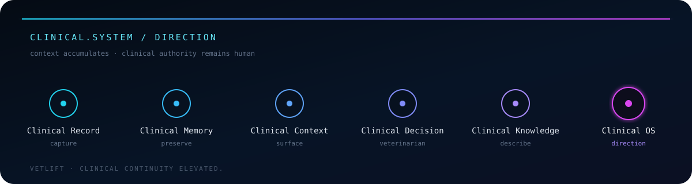
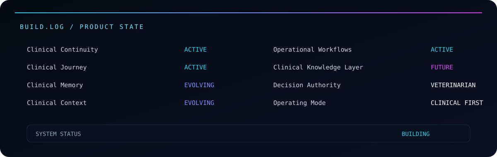
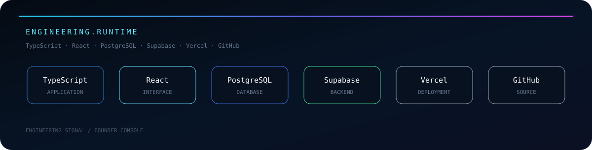
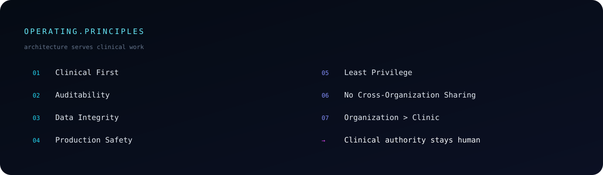
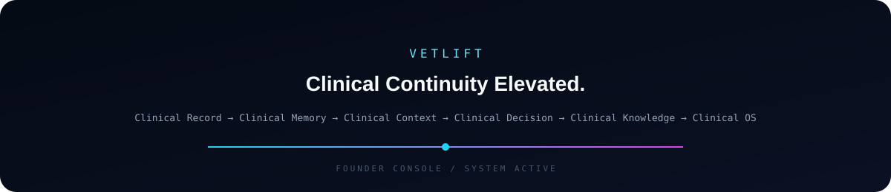

<p align="center">
  
</p>

<table>
<tr>
<td width="31%" valign="top" align="center">


### `OPERATOR`

**Ihsanul Firdaus**

Veterinarian  
Founder  
Product Architect

`ACTIVE CLINICIAN`

</td>

<td width="69%" valign="top">

## `SYSTEM.INFO`

`DOMAIN` &nbsp;&nbsp;&nbsp;&nbsp;&nbsp;&nbsp; Veterinary Medicine  
`PLATFORM` &nbsp;&nbsp;&nbsp;&nbsp; VetLift  
`FOCUS` &nbsp;&nbsp;&nbsp;&nbsp;&nbsp;&nbsp;&nbsp; Clinical Continuity  
`MODE` &nbsp;&nbsp;&nbsp;&nbsp;&nbsp;&nbsp;&nbsp;&nbsp; Active Development  
`RUNTIME` &nbsp;&nbsp;&nbsp;&nbsp;&nbsp; [vetlift.app](https://vetlift.app)

### `MISSION`

Building a **clinical-first veterinary platform** around a simple principle:

> **The patient may return, but the clinical context should never have to start from zero.**

VetLift is designed to preserve continuity across the patient's evolving clinical journey while keeping the veterinarian as the authority for clinical decisions.

### `AUTHORITY.RULE`

**Technology should surface context. Clinical judgment remains human.**

</td>
</tr>
</table>

---

<p align="center">
  
</p>

## `CLINICAL.AUTHORITY`

VetLift is built to organize, preserve, and surface clinically relevant information.

The system should make the patient's story easier to **understand, continue, and act on** — without replacing the veterinarian's authority to interpret the patient and make clinical decisions.

---

<p align="center">
  
</p>

---

<p align="center">
  
</p>

---

<p align="center">
  
</p>

---

## `PRODUCT.LANGUAGE`

| Clinical System | Operational System |
|---|---|
| `Clinical Memory` | `Clinical Operating Summary` |
| `Clinical Context` | `Operational Clinical Decision` |
| `Clinical Brief` | `Clinical Vital Trend Review` |
| `Clinical Journey` | `Descriptive Clinical Knowledge` |

---

## `FROM.CLINIC.TO.CODE`

I'm a veterinarian building software around problems encountered directly in active clinical practice.

My work sits at the intersection of:

`Veterinary Medicine` · `Clinical Systems` · `Product Architecture` · `Software Engineering` · `Clinical Operations`

Product decisions are continuously tested against one question:

> **Does this make the patient's clinical story easier to understand, continue, and act on?**

---

## `CURRENT.FOCUS`

```text
> preserve clinical continuity
> structure longitudinal patient information
> surface relevant clinical context
> maintain clear clinical authority
> build operational workflows around clinical reality
> evolve VetLift from clinical record toward clinical OS
```

---

<p align="center">
  
</p>

<div align="center">

[](https://vetlift.app)

</div>
