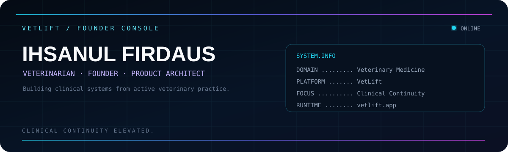

<p align="center">
  
</p>

<br>

<div align="center">

# `VETLIFT / FOUNDER CONSOLE`

### Ihsanul Firdaus

**Veterinarian · Founder · Product Architect**

*Clinical Continuity Elevated.*

[](https://vetlift.app)


</div>

---

<table>
<tr>
<td width="32%" valign="top" align="center">


<br>

### `OPERATOR`

**Ihsanul Firdaus**

Veterinarian  
Founder  
Product Architect

</td>

<td width="68%" valign="top">

## `SYSTEM.INFO`

`DOMAIN` &nbsp;&nbsp;&nbsp;&nbsp;&nbsp;&nbsp; Veterinary Medicine  
`PLATFORM` &nbsp;&nbsp;&nbsp;&nbsp; VetLift  
`FOCUS` &nbsp;&nbsp;&nbsp;&nbsp;&nbsp;&nbsp;&nbsp; Clinical Continuity  
`STATUS` &nbsp;&nbsp;&nbsp;&nbsp;&nbsp;&nbsp; Building  
`RUNTIME` &nbsp;&nbsp;&nbsp;&nbsp;&nbsp; [vetlift.app](https://vetlift.app)

<br>

## `MISSION`

Building a **clinical-first veterinary platform** around a simple principle:

> **The patient may return, but the clinical context should never have to start from zero.**

VetLift is designed to preserve continuity across the patient's evolving clinical journey while keeping the veterinarian as the authority for clinical decisions.

</td>
</tr>
</table>

---

## `CLINICAL.DIRECTION`

```text
Clinical Record
      │
      ▼
Clinical Memory
      │
      ▼
Clinical Context
      │
      ▼
Clinical Decision
      │
      ▼
Clinical Knowledge
      │
      ▼
Clinical OS
```

The system should organize and surface relevant clinical information.

**Clinical judgment remains with the veterinarian.**

---

## `PATIENT.JOURNEY`

```text
PATIENT
  │
  ├── Clinical Record
  │
  ├── Problems
  │
  ├── Clinical Journey
  │
  ├── Clinical Memory
  │
  ├── Clinical Context
  │
  └── Follow-up & Outcomes
```

Rather than treating every visit as an isolated record, VetLift is built around the patient's longitudinal clinical story.

---

## `PRODUCT.LANGUAGE`

| Clinical System | Operational System |
|---|---|
| `Clinical Memory` | `Clinical Operating Summary` |
| `Clinical Context` | `Operational Clinical Decision` |
| `Clinical Brief` | `Clinical Vital Trend Review` |
| `Clinical Journey` | `Descriptive Clinical Knowledge` |

---

## `BUILD.LOG`

```text
VETLIFT / ACTIVE DEVELOPMENT

Clinical continuity ............ ACTIVE
Clinical journey ............... ACTIVE
Clinical memory ................ EVOLVING
Clinical context ............... EVOLVING
Operational workflows .......... ACTIVE
Clinical knowledge layer ....... FUTURE DIRECTION

SYSTEM STATUS ................... BUILDING
```

---

## `ENGINEERING.STACK`

<p>


</p>

```text
APPLICATION ........ TypeScript / React
DATABASE ........... PostgreSQL
BACKEND ............ Supabase
DEPLOYMENT ......... Vercel
SOURCE CONTROL ..... GitHub
```

---

## `OPERATING.PRINCIPLES`

```text
01  Clinical First
02  Auditability
03  Data Integrity
04  Production Safety
05  Least Privilege
06  No Cross-Organization Sharing
07  Organization > Clinic
```

> Architecture should serve clinical work — not force clinical work to adapt to the architecture.

---

## `FROM.CLINIC.TO.CODE`

I'm a veterinarian building software around problems encountered directly in active clinical practice.

My work sits at the intersection of:

`Veterinary Medicine`

`Clinical Systems`

`Product Architecture`

`Software Engineering`

`Clinical Operations`

Product decisions are continuously tested against one question:

> **Does this make the patient's clinical story easier to understand, continue, and act on?**

---

## `CURRENT.FOCUS`

```text
> preserve clinical continuity

> structure longitudinal patient information

> surface relevant clinical context

> maintain clear clinical authority

> build operational workflows around clinical reality

> evolve VetLift from clinical record toward clinical OS
```

---

<div align="center">

## `VETLIFT`

### Clinical Continuity Elevated.

**Clinical Record → Clinical Memory → Clinical Context → Clinical Decision → Clinical Knowledge → Clinical OS**

<br>

[](https://vetlift.app)

<br><br>

`SYSTEM ONLINE`

</div>
